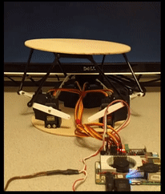

# Stewart platform source examples
Copyright (C) 2015-2017 Intel Corporation

## Overview



This directory provides **examples** that serve as supplimentary
material for the Developer Journey [1] to build a type of parallel 
robot called a Stewart platform [2].

1. https://01.org/developerjourney/stewart-platform
2. https://en.wikipedia.org/wiki/Stewart_platform

The examples contain software to:

* Communicate via i2c to a PCA9685
* Solve the Stewart platform to determine servo positions
* Utility functions for controlling the Stewat platform

To reduce dependencies, this program is not using MRAA to communicate
with the PCA9685.


## Stewart platform coordinate orientation

These routines work in a standaridzed world coordinate system (WCS)
where the XZ plane is the plane the Stewart platform is aligned to 
when no rotations are being performed (looking down on the Stewat 
platform.) The Y axis is aligned to the height of the Stewart platform 
axis (gravity).

The XZ plane is oriented such that the Z axis passes from between
servo 0|5 through the center of the platform (0, 0):

                                  z+
                                  ^
                                  |
                             .----+----.
                          2 /     |     \ 3
                           /      |      \
                        1 /       |(0,0,0)\ 4
                 x- <--- <--------+--------> ---> x+
                          \       |       /
                           \      |      /
                            \     |     /
                             `----+----'
                                0 | 5
                                  v
                    Top View      z-


## Building utilities

To build:

```bash
make
```

To test:
```bash
sudo bin/transform PITCH ROLL YAW X Y Z
```

For example:
```bash
sudo bin/transform 1 0 0  0 0 0
```

The above will rotate the platform one degree around the X axis.


## Piping data from STDIN

The `bin/transform` program can also read values from STDIN. When it
does so, however, it expects values to be provided in Axis-Angle form:

```bash
echo "0 1 0 3.5" | sudo bin/transform
```

The above will rotate the platform around the axis <0,1,0> by 3.5 degrees.


## Recording and playing back sequences

When piping data into transform, you can optionally record the sequence
of commands with timing information. You can then play that file back to
the application to repeat actions and movement sequences.

For example:
```bash
bin/joytrack /dev/input/js0 | bin/record MOVEMENTS | sudo bin/transform
```

You can then record a movement using your joystick (see the next section
for configuring a PlayStation 3 USB controller.) When you are done, 
press CTRL-C.

To play the file back:

```bash
bin/playback MOVEMENTS | sudo bin/transform
```

## Using a PS3 USB Controller

To use a PS3 USB controller to control the platform, you either need a
USB Bluetooth adapter or use it wired via the USB cable.

I have used the Rocketfish Micro USB Bluetooth adapter, which is 
supported in Ubuntu 16.04. You also need to pair the PS3 
controller with the system. You can follow the instructions here:

  http://qtsixa.sourceforge.net/manual.pdf

If you don't need/want to use the controller wirelessly, you can just
plug it into the USB port and open the joystick interface.

To do this, you only need the joystick package:

```bash
sudo apt install -y joystick
```

Once the PS3 controller is paired and recognized in the system (or if you
have any other joystick installed) you can use the program joytrack:

```bash
bin/joytrack /dev/input/js0 | sudo bin/transform
```

You can then control pitch and roll with left directional controller.
