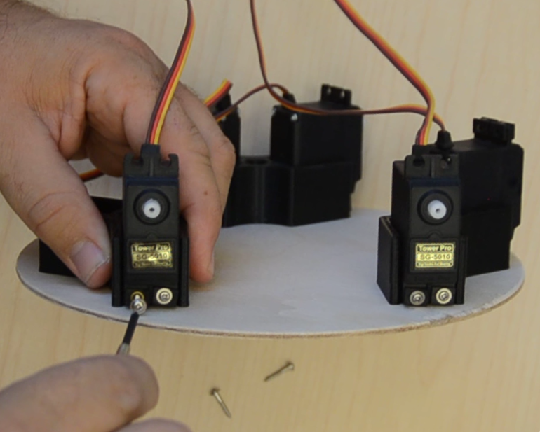

# Introduction


Connecting the digital world to the physical world is exciting.

This guide provides you with the 3D models, information, and software to create your own Stewart platform.

## What is a Stewart platform?

Not familiar with a Stewart platform?

Stewart platforms have been used in vehicle and flight simulators, robotic skeleton assemblies, interactive marble maze solvers, and many other purposes.

A [Stewart platform](https://en.wikipedia.org/wiki/Stewart_platform) is a parallel robot with six degrees of freedom (6DOF).

The six degrees of freedom include movement in along three axis (X, Y, Z) as well as rotating in three directions (yaw, pitch, and roll.)


# Ingredients

Acquiring the parts is the most time consuming task. We've taken the guess work out by providing exact part descriptions and links to example products on the Internet. There are three main categories of parts:

* The mechanical parts for the Stewart platform
* The electronics; wires, servos, breakout board
* The computer for controlling the Stewart platform

The total cost of all required parts, including the computer board, is ~$300US. If you print your own parts, you can save ~$70US.

## Mechanical parts

The mechanical parts needed for the Stewart platform include the top and bottom platforms, control rods to connect servos to the top platform, and the 3D printed components.

The total cost to acquire the mechanical parts is approximately $100US. If you have your own 3D printer, you can save ~$66US.


## Top and Base platform

| Qty | Name | Description | Est.$ |
|:---:|-----------|-------------|--------|
|  2  | 8” MDF (or similar) wooden circles | Used as top and base plates. You can use a different size, however the board should be ⅛” ~ ¼” thick for rigidity and at least an 8” diameter [Amazon](https://www.amazon.com/gp/product/B00X6ATXHC) | $9 |
| 12  | M3 x 15mm Button Head Cap Screws (BHCS) | Helion HLNS1186 Button Head Cap Screws (BHCS) M3x15mm (10pcs) [Amazon](https://www.amazon.com/Helion-HLNS1186-Button-Screws-M3x15mm/dp/B01LXFZQ01) | $7 |
|  12 | #3 Phillips countersink screw with 8mm threading (10mm screw) | Used to connect control rod block and servo block platform boards. **NOTE**: Adjust the length of the countersunk screws to be the thickness of the MDF wooden circle + 5mm. If the screw is too long, it will stick through the wood; you can then grind/file the edge off. | $2 |


## Control rod components

| Qty | Name | Description | Est.$ |
|:---:|-----------|-------------|--------|
| 12  | 10mm M3 threaded shaft (set screw) | Used to connect the ball joint to the connecting rod. [Amazon](https://www.amazon.com/RC4ZS0010-RC4WD-Threaded-Shafts-Screws/dp/B00A795L30) | $5 |
|  6  |65mm M3 aluminum standoff spacer|Used as the connecting rod. [Amazon](https://www.amazon.com/gp/product/B01NBXUD1E) | $5 |
| 12  |M3 straight ball joint|Pivot points between the connecting rods, the servos, and the platform. [Amazon](https://www.amazon.com/RC4WD-Medium-Straight-Plastic-Rod/dp/B009PBXIRW) | $5 |


## 3D Printed Parts

There are a total of twelve parts to print. Three servo mounting blocks, six servo arms, and three top plate mounting brackets.

You can download and print the models yourselves, or print them via a 3rd party service. You can find 3D printers in your area via services like [Treat Stock](https://www.treatstock.com/3d-printable-models).

PLA is a sufficient material to use when printing.

Depending on where you have your parts printed, the cost to print all of the necessary parts is around $70US.

### Servo mount

Sized to fit standard size servos, each block holds two servos. The servo blocks are designed to hold servos of depth 27.8mm, width 20mm.

Download the STL file [here](https://raw.githubusercontent.com/developer-journey/stewart-platform/master/models/ServoMount.stl).

|Qty|STL Link|Dimensions|Volume|
|:--:|:---|:---|:---|
|3|[Servo mount](https://raw.githubusercontent.com/developer-journey/stewart-platform/master/models/ServoMount.stl)|76mm x 26mm x 58mm|34,430mm ^ 3

### Servo arm

Configured to fit 25-tooth servos (T25) the servo arms are 34mm from center to rod pivot point. The arms are bidirectional allowing you to adjust alignment after the servos have been set to their zero position.

Download the STL file [here](https://raw.githubusercontent.com/developer-journey/stewart-platform/master/models/ServoArm.stl).

|Qty|STL Link|Dimensions|Volume|
|:--:|:---|:---|:---|
|6|[Servo arm](https://raw.githubusercontent.com/developer-journey/stewart-platform/master/models/ServoArm.stl)|78mm x 7mm x 11mm|2,794mm ^ 3|


### Top mount

Mounted to the top plate, the control rod assemblies connect to these.

The holes are countersunk on one side -- make sure that side faces away from the board when mounting (so the screws can be flush.)

Download the STL file [here](https://raw.githubusercontent.com/developer-journey/stewart-platform/master/models/TopMount.stl).

|Qty|STL Link|Dimensions|Volume|
|:--:|:---|:---|:---|
|3|[Top mount](https://raw.githubusercontent.com/developer-journey/stewart-platform/master/models/TopMount.stl)|12mm x 11mm x 61mm|5,306mm ^ 3


## Electronics

The electronics consist of the UP board, a PWM breakout board, wires, connectors, power supply, and the hobby servos. 

The total cost of electronics is approximately $200US.

Items you may already have (HDMI cables, keyboard, etc.) are not included in the price estimate.

| Qty | Name | Description | Est.$ |
|:---:|-----------|-------------|--------|
|  6  | Standard hobby servo | Higher quality servos yield a more stable platform; that said, most of my platforms are built using the cheapest servos I can find. **NOTE:** The 3D models for this recipe are designed for standard hobby sized servos with a T25 spline, a depth of 27.8mm, and a width of 20mm. | 6x$9=$54 |
|  1  | PCA9685 breakout board | I2C based board that provides 16 PWM channels. The Stewart platform only needs 6 of those channels--leaving 10 available for LEDs and other features! Different vendors sell the PCA9685 breakout boards with all parts pre-soldered. [Amazon](https://www.amazon.com/dp/B014KTSMLA) | $12 |
|  4  | Female to female jumper wires | Used to connect GND, VCC, I2C SDA, and I2C SCL from the UP’s 40-pin HAT to the PCA9685 board | |
|  1  | 5V 10A DC power source | Used to provide power to the servos controlled by the PCA9685. Powering six servos will pull more current than a lower amperage power adapter can supply.  [Amazon](https://www.amazon.com/ALITOVE-Adapter-Converter-Charger-5-5x2-1mm/dp/B01M0KLECZ) | $21 |
|  1  | Female barrel plug connector | Used to create a connector for the 5V 10A DC power supply [Amazon](https://www.amazon.com/ALITOVE-Adapter-Converter-Charger-5-5x2-1mm/dp/B01M0KLECZ). This comes with the 10A power supply linked above. If you want to get one by itself, see [Amazon](https://www.amazon.com/CableWholesales-Female-Power-Terminal-Adapter/dp/B009H0TJ88) | $0 |
|  2  | 12” length of 18AWG or lower | Used to connect the female barrel plug to the PCA9685’s DC V+ and GND terminals. | |


## UP board

You need an UP board running Ubuntu 16.04 or newer for this recipe. If you do not have an UP board, below are the components you need. For instructions on installing Ubuntu 16.04 onto the UP board, you can follow Steps 1 through 5 of [Intel RealSense Robotic Development Kit](https://01.org/developerjourney/recipe/intel-realsense-robotic-development-kit).


| Qty | Name | Description | Est.$ |
|:---:|-----------|-------------|--------|
|  1  | UP board  | Used to solve the Stewart platform equations, control the servos, and provide additional compute resources for custom features. [up-shop](https://up-shop.org/up-boards/2-up-board-2gb-16-gb-emmc-memory.html) | $99 |
|  1  | 5V 4A power supply for the UP board | Provides power to the UP board. [up-shop](https://up-shop.org/up-peripherals/65-dc-power-adapter-for-up-board-eu-plug.html) The 5V 10A supply (in the prior section) may is typically enough to power both the servos **and** the UP board, however using a single power supply requires you to build a Y-connector. | $11 |
|  1  | USB Keyboard | Used for input to the UP board | |
|  1  | HDMI cable | Used for the UP board | |
|  1  | HDMI monitor | Used for the UP board | |
|  1  | 8G+ USB flash drive | Used for installing Ubuntu  onto the UP board | | 
|  1  | (optional) USB mouse | If you want to use a GUI with the UP, a mouse makes it easier. | |
|  1  | (optional) Ethernet cable | Used to provide network to the UP board | |


## Tools

The following tools are used to assemble the pieces:


| Name       | Description                                    |
|-----------------|------------------------------------------------|
| 5/64” drill bit | Used to make pilot holes for wood screws in top and base platform boards. |
| Drill           | Use with the drill bit. |
| 2mm allen wrench | Used to install cap screws into servo assemblies |
| Philips screw driver | Used to install servos into servo blocks, servo arm screw, and to tighten power leads into power terminals. |
| Wire stripper or utility knife | Used to strip the wires from the 5V 10A DC power supply |


# Step 1: Assemble six control rods


Assemble six control rods. For each rod, thread one 10mm M3 threaded rod into each of the M3 ball joints until the threaded rod is approximately half way into the joint. Then screw the other half into the 65mm M3 standoff. Repeat on both ends of the standoff.


**NOTE:** If you screw the threaded rod into the standoff first, there may not be enough friction between the threads and the standoff to successfully screw the second half of the rod into the ball joint.


# Step: Attach control rod assembly to top platform bracket


Use six 15mm button head screws to attach the control rods to the three top platform brackets.


# Step: Attach servo arm to control rod bracket assembly

 Next attach servo arms to the the control rod bracket assemblies using six 15mm button screws.


Be sure to orient the servo arm correctly as seen in this image.


# Step 4: Drill top and base platforms

Print out the top and bottom platform templates.


Link to PDF: [top-platform.pdf](https://raw.githubusercontent.com/developer-journey/stewart-platform/master/models/top-platform.pdf)


Link to PDF: [base-platform.pdf](https://raw.githubusercontent.com/developer-journey/stewart-platform/master/models/base-platform.pdf)


Print the templates from the PDFs on 8.5” x 11” paper in portrait mode -- and turn off all margins, scaling, and resizing. You want the edge guide marks to be at the edge of the printed sheet--if you scale the printouts in any way, the holes you drill won’t match the 3D printed parts.


**NOTE:** The board edge in the printout is to help in centering the paper to the board and may not be the same size as your board.

*Tip:* To prevent slipping while drilling, use tape to affix the board to the back of top platform assembly. 

You can use a screwdriver to tap an indentation on the exact center points to help prevent the drill from wandering.

When drilling the base platform, you only need to drill the six holes along the edge--the third hole is optional.


# Step: Attach control rod assembly to top platform

Using six of the wood screws, attach the three control rod assemblies to the top platform. 


The control rods should be on the outside edge of the circle.

**NOTE:** Only one side of each mounting block has countersunk holes.


If your screws are too long and stick through the board, use a file to grind down the tip of the screw.

For added strength, you can place a drop of wood glue at each pilot hole prior to affixing the bracket to the top platform.


# Step: Attach servo blocks to bottom platform


Using six wood screws, attach the three servo blocks to the base platform.

If the screws are longer than the thickness of your base platform, file off any of the screw protruding from the bottom of the base.


# Step: Attach servos to servo blocks

Use the screws that came with your servo to attach the six servos to the three mounting blocks on the base platform.


### Number the servos

After you have installed the servos, mark servo #1 so you can refer to it later. When calibrating  and connecting the servos, they are referred to via their clockwise numbering.


# Step: Attach the two platforms

Align the top platform such that the control rod mounting bracket is parallel to the face of two servos. Attach the servo arms with the control rods on opposite sides as seen in this image. Rotate and do the same for the remaining four servos.

**Do not** screw in the servo arms into the servos at this time. When the Stewart platform is initialized, all of the servos will reset to their zero position and you may need to make adjustments


# Step: Attach servo wires to PCA9685

Next attach the six servos to the PCA9685 breakout board.

This tutorial is using Tower Pro SG-5010 servos. Those servos use the following color scheme:

| Color | Pin |
|:------|:----|
|YELLOW | PWM |
|RED    | V+  |
|BROWN  | GND |

Servo #1 (marked with blue tape) is being connected to PCA9685 PWM channel 0.

Starting with servo #1, route the servo wire out of the Stewart platform and connect it to the PCA9685 board, beginning with channel 0. 


Continue in a clockwise direction around the Stewart platform, routing the wires through the same space between servos on the platform.  Attach each servo to the next open channel on the PCA9685.

# Step: Attach PCA9685 to UP board

The PCA9685 is controlled using a two wire protocol for control called I2C. In addition to the two wires for I2C, the PCA9685 needs to be connected to ground and 3.3V.

Connect the four jumper wires to PCA9685’s GND, SCL, SDA, and VCC pins.

In the following image BLACK is connected to GND, WHITE is connected to SCL, GRAY is connected to SDA, and RED is connected to VCC.


On the UP board, connect GND (Black) to [pin 6](https://board-explorer.github.io/board-explorer/#up-board/HATPin6), VCC (Red) to [pin 1](https://board-explorer.github.io/board-explorer/#up-board/HATPin1), SDA (Gray) to [pin 3](https://board-explorer.github.io/board-explorer/#up-board/HATPin3), and SCL (White) to [pin 5](https://board-explorer.github.io/board-explorer/#up-board/HATPin5):


See [Board Explorer: UP](https://board-explorer.github.io/board-explorer/#up-board/HATPin1,HATPin3,HATPin5,HATPin6) for an interactive view of the UP board’s pin headers.


 Once all of the servos and the I2C wires have been connected to the UP board, it should look like the image here.


# Step: Wire DC terminal to the PCA9685

Attach one 12” length of 18AWG wire to the PCA9685’s GND terminal and the other wire to the PCA9685’s V+ terminal. Use a small phillips screwdriver to make the connection secure.


Attach the other side of the wires to the female barrel plug connector. Make sure the PCA9685’s V+ terminal is connected to the + terminal on the barrel connector.

**Do not plug the power supply into an outlet yet.**


## Step: Connect peripherals to UP board

Connect the USB keyboard, HDMI cable, and DC adapter. **Do not plug the power supply into an outlet yet.**


# Step: Power it up!

Remove all of your tools from the vicinity of the UP board and PCA9685 breakout board.

Re-check that all of your connections are still good, and that no wires have come loose. You are now ready to supply power to the UP board and PCA9685.


Using a splitter, a single 5V 10A adapter provides power to both the UP board and PCA9685.

 Once power is applied, the UP board’s power LED should illuminate. Similarly, an LED should illuminate on the PCA9685 breakout board.


If you have not already installed a Linux operating system on the UP board, you can follow Steps 1 through 5 of [Intel RealSense Robotic Development Kit](https://01.org/developerjourney/recipe/intel-realsense-robotic-development-kit) to get Ubuntu 16.04 installed.

This will prepare your UP board to initialize the Stewart platform during the final assembly steps.


# Step: Initialize the servos

Prior to finalizing the Stewart platform by installing the screw into servo arms, the servos must be initialized to zero. 

To do that, use the ‘transform’ utility (provided via the stewart-platform repository) to initialize all six servos to zero.


## Install build tools and git

To build the Stewart platform project, the UP board needs to have the build tools installed.

From a command terminal on the UP board, perform the following steps:

```bash
sudo apt install -y build-essential git
```

## Clone and build the Stewart platform project

```bash
cd ~
git clone https://github.com/developer-journey/stewart-platform.git
cd stewart-platform
make
```

## Initialize the servos

```bash
cd ~/stewart-platform
sudo bin/transform 0 0 0  0 0 0
```

The servos should all move to their **internal** zero position. 

If the software can not connect to the PCA9685 device, it will output an error. If you encounter an error, make sure that you are running the ubilinux kernel provided by UP board (as described in the installation tutorial)--without that kernel, the 40-pin HAT is not enabled.

## Adjust the servos to zero position

Once the servos are powered initialized using `transform 0 0 0  0 0 0`, you can adjust the servo arms as necessary, then secure them using the scews provided with your servo.

 After initialization, servo is at zero and servo arm is misaligned.  

While servo is at zero, remove and reset the servo arm to horizontal.


 **Note** the servo arm may not be able to be exactly horizontal. 

The servo arms have 25 teeth in them to grip the servo. This allows them to be offset by one half of a tooth to provide better alignment by rotating the servo arm 180 degrees.

To remedy, unscrew the control rod from the servo arm, rotate the servo arm 180 degrees, and see if it can mount closer to horizontally. Pick whichever is closest to horizontal. Re-attach control rod.


Arm is now horizontal at servo 0 position. Install the servo arm set screw to fix the arm at this position.


# Step: Put the platform through its motions

You are now ready to control the Stewart platform!

Boot the UP board back up and use the transform routine to test the performance of the platform.

The ‘transform’ utility allows you to move the platform in three dimensions (the first three parameters) in millimeters, and to tilt the platform in three angles (the last three parameters) in degrees.

```bash
cd stewart-platform
# center the platform
sudo bin/transform 0 0 0  0 0 0
# move up / down
sudo bin/transform 0 0 5  0 0 0 # up
sudo bin/transform 0 0 -5  0 0 0 # down
# move left / right
sudo bin/transform -5 0 0  0 0 0 # left
sudo bin/transform 5 0 0  0 0 0 # right
# move forward / back
sudo bin/transform 0 5 0  0 0 0 # forward
sudo bin/transform 0 -5 0  0 0 0 # back
```

Experiment with all of the parameters.

For information on how the Stewart platform equations are solved in software, see the journey entry [Solving Stewie](https://01.org/developerjourney/solving-stewie).

View `stewart-platform/README.md` for additional information and utilities provided with the Stewart platform project.

# Step: Do the wave!

The `transform` utility can either take input from the command line, or via `stdin`. Included in the [stewart-platform project](https://github.com/developer-journey/stewart-platform) is a NodeJS application which will output to stdout command for transform.


```bash
sudo apt install -y nodejs
cd ~
node node/wave | sudo bin/transform
```


# Congratulations!

Congratulations! You have built a functional Stewart platform. Tell us how it went by leaving a comment.

If you have any problems, you can file an issue with the [Stewart platform](https://github.com/developer-journey/stewart-platform/issues) project on GitHub.

# What's coming next?

We're working on the next article using the Stewart platform...

 Using a PS4 controller you can play the labyrinth marble game.

Add a camera, and you can now experiment with vision processing, machine learning, and artificial intelligence to have the computer play itself!


# Appendix B: Adjusting the Stewart platform dimensions

The software to control the Stewart platform is pre-programmed with dimensions that match the 3D printed models.

If you modify the models to fit different servos or arrangements, you may need to modify the `config.h` file and re-build.

The images below are intended help you better understand which values to measure:


## SERVO_ARM_LENGTH


Servo arm length in inches from center to ball joint pivot.

Defaults to 1 5/16” (34mm)


## CONTROL_ROD_LENGTH


Control rod length in inches from ball joint center to center.

Defaults to 3 7/16” (90mm) 


## PLATFORM_HEIGHT


With servos at 0 position, vertical distance servo axis to the top of the control rod’s ball joint (in the above image, it is the green line.)

This is used as Z coordinate in the effector_pos.

Defaults to 6 ⅜” (162mm)


**NOTE**: This is a value that could be calculated automatically based on the triangles formed from the servo arm, control rod length, and the top and bottom radii. However I haven't done that yet, so the code must define it.

## EFFECTOR_RADIUS


Center of top platform to effector ball joint connector center in inches.

Defaults to 3 ⅝” (92.5mm)


## BASE_RADIUS


Center of base platform to control rod *pivot** point along servo arm axis, in inches.

Defaults to 4” (101.6mm)

**NOTE**: This is not just the measurement to the servo arm, but to where the plane of the control rod's ball joint intersects with the servo arm axis.


## THETA_BASE


Angle (THETA) between paired servo arm pivot points (BASE)

In the above image, it is the angle spanning to the servo arm (the larger of the two angles) That angle is to the base’ axis (31.6°). The angle between two servos is twice that, or 63.2°.

Defaults to 63.2° (1.1rad)


## THETA_EFFECTOR


Angle (THETA) between paired effector attachment points (EFFECTOR)

In the above image, it is the angle spanning to the control arm connector (the smaller of the two angles) That angle is to the base’ axis (16.3°). The angle between two servos is twice that, or 32.6°.

Defaults to 32.6° (0.57rad)

